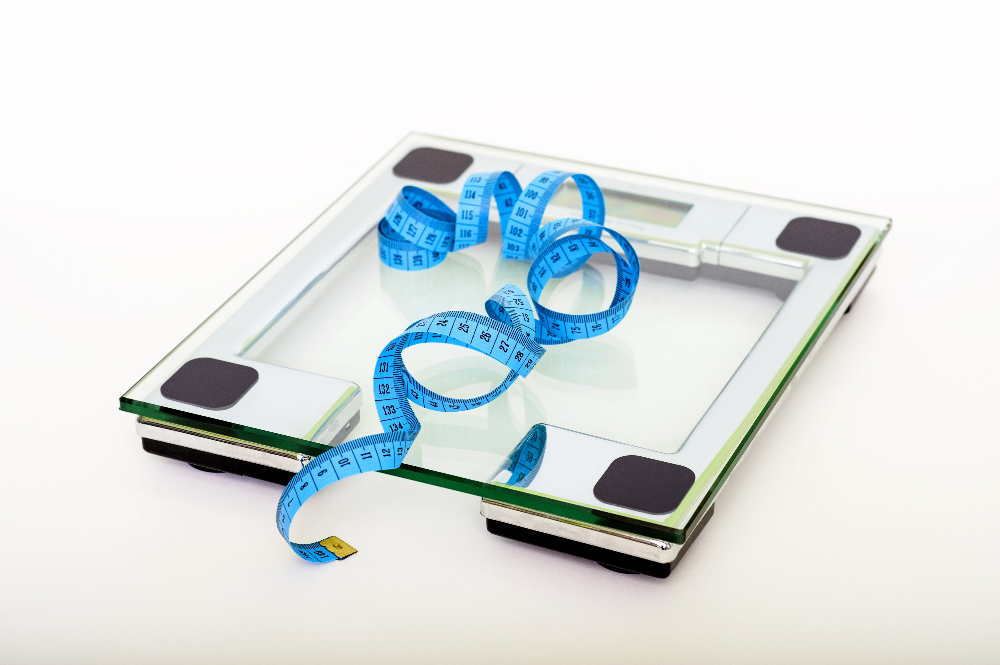
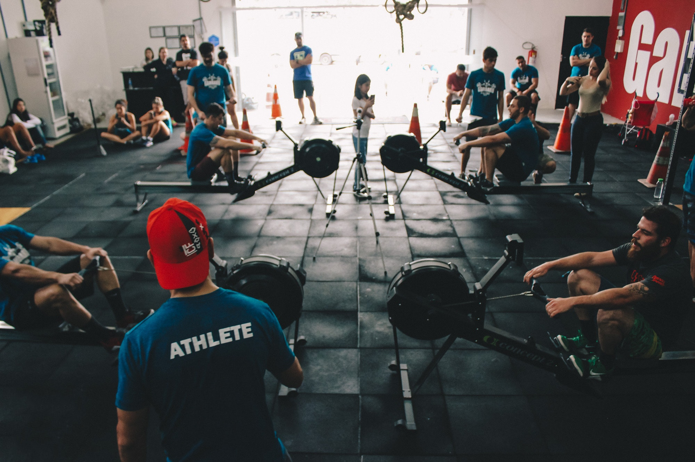
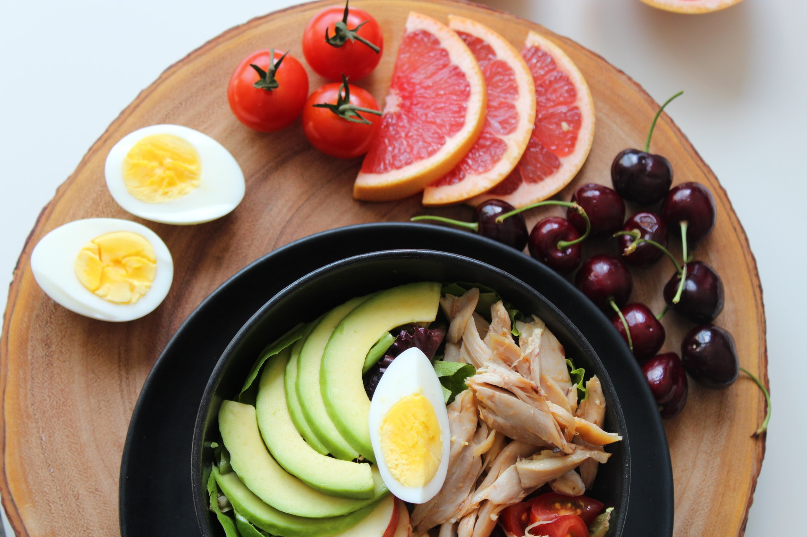

*"I don't have the energy to work out"*

--

*"I don't have the time to plan ahead and eat healthy"*

--

*"I'm focused on my career right now. Once I reach [X] goal I'll work on getting in shape"*

Do any of these lines sound familiar to you? I know they're all statements I would have made at one point. Unfortunately, many of us use our careers as an excuse for poor fitness habits. I know firsthand that working as a web developer can make it easy to fall into bad health habits. Think about it - a mentally taxing job where you sit for long periods of time, fall into poor sleep habits by staying up late working on projects, and binge on sugary drinks and snacks in an attempt to stay energized. 

***
### Development is perfectly suited to wrecking your fitness.
***

That said, I know there are many other careers where time pressures, stress, and physical demands (or lack thereof) can have similar results. It's not an issue unique to developers - many of us end up choosing our jobs over our health.

**But what if I told you it wasn't an either / or scenario?**

About 9 months ago I came to a point where I realized I had done this for too long. I was significantly overweight, wasn't taking time for exercise, and was making terrible eating choices. Taking inspiration from [Chris Pratt's weight loss](https://www.mensjournal.com/health-fitness/how-chris-pratt-dropped-60-pounds-six-months/), I made some very deliberate choices about meal planning and exercise and stuck with them. Over 6 months I lost over 40 pounds and gained significant muscle mass. In the last 3 months I've successfully managed to maintain that weight loss.

And guess what? My career didn't suffer at all as a result. In fact, I've taken some great steps in professional development during that time; I started a new development job and was able to make significant contributions to a number of important projects, all while taking time for my physical health. That's when I came to realize something:

***
### One of the best things you can do for your career is to make your physical health a priority.
***

That's right. Focusing on your health won't just 'not hurt' your career - it is a huge step *toward* achieving your career goals! In the course of getting in shape **I noticed a number of positive effects my increased focus on fitness had on my work performance:**

#### 1. I have more energy
Not everyone has excess weight to lose, but if you do, think about this - carrying around that weight is the equivalent of carrying around a heavy backpack everywhere you go. My overall energy level now is so much higher than it was before I got in shape. Even if I set aside any cardiovascular or strength gains I've made, the fact still remains that I feel like a 40-pound backpack I carried around everywhere is gone!

#### 2. I have more mental clarity
Making better eating choices put me much more in touch with how food makes me feel. While sugars and simple carbs may give a temporary energy boost, sticking with veggies and high-protein snacks leaves me feeling much less 'foggy' during the day. I'm not necessarily advocating ideas like going [keto](https://www.healthline.com/nutrition/ketogenic-diet-101) or trying [intermittent fasting](https://www.healthline.com/nutrition/intermittent-fasting-guide) - I've just found that in general healthy food leaves you feeling mentally sharper.

#### 3. I am less stressed
Regular exercise is a wonderful way to deal with stress. It gives your mind a break and gives you a physical outlet to work off stress. Building exercise into your life as a daily rhythm helps so much when you're dealing with stressors - both ongoing and temporary. One small trick I've learned is that going out for a short walk is a great way to gain perspective on a problem I'm stuck on. I can't tell you how many answers to a coding problem have come to me mid-workout.

#### 4. I am happier
It's a proven fact that exercise boosts your endorphin levels. Beside that, making good choices around your physical health will make you happier overall. And I don't know about you, but I do better work when I'm happy. When I'm happy I'm more creative, more committed, and a better problem solver and communicator.

#### 5. I am more confident
I'm a naturally outgoing person. I've never considered myself to be someone who lacks confidence, but getting in shape has made me more confident that I was previously. Before I made the choice to pursue healthy habits I lived with a constant sense of disappointment in myself; I felt a nagging sense of frustration with my failure to make healthy choices. I avoided stepping on the scale and would try to avoid anything that made me think about the neglect I was showing my health. Now I can embrace a part of my life that I was trying to section off, and even when I take a "cheat day" I can get right back into the swing of things.

***

I write this post in hopes of providing inspiration to others who might find themselves at the same place I was - wanting to make a change, but feeling like you don't have the bandwidth to do so. Take it from me - getting in shape is a worthwhile investment of time, and it will be a better investment in your career than an extra half hour of looking at a computer screen.

I'll leave it to you to look up the specifics on excercise and diet plans (there's more than enough good information out there, and I know there are different opinions on this) - but for what it's worth, here are the simple rules I've lived by:

#### 1. Plan and prep healthy food ahead of time.
You can eat great, healthy food without breaking your bank - but you absolutely need to prep ahead of time. I usually make meals ahead Sunday evening - I'll portion out veggies for snacks, make chicken wraps, and pre-portion high protein snacks like eggs, greek yogurt, and turkey chili. That way every morning when I leave for work I just grab a few items that are all ready and I don't have to worry / think at all about what I'm going to eat.

#### 2. Exercise every day.
Different people are at different levels here, but I like to hit a mixed weights / cardio workout in the morning and go for a walk at lunch. I set a goal to hit 20,000 steps on my fitbit every day. Even if that's not where you're at personally, find a realistic exercise goal and stick with it. I will say, the nice thing about weight work is that as you build muscle mass, you burn more calories in a rest state.

#### 3. Plan on cheat meals - aside from that, stay within strict guidelines.
In general the weekends are when I cheat. Aside from that I had to learn to say a polite "no, thank you" to snacks that are brought into the office, desserts, and anything outside of my diet plan. It was tough at first, but once you get into a good routine it seems like cheat meal days come pretty quickly, and it's much easier to say 'no' to tempting things when you know you can enjoy whatever you want in a day or two.

That's it. I don't have any silver bullets, and I know as well as anyone that you can't make up for years of bad habits in a few days. But I do know this - if you choose to start making better fitness decisions today, you will reap the rewards a few months down the road - both in your physical health and in your career.