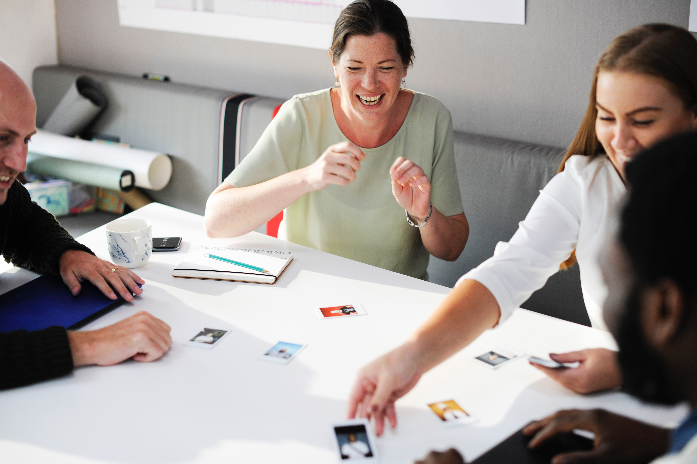
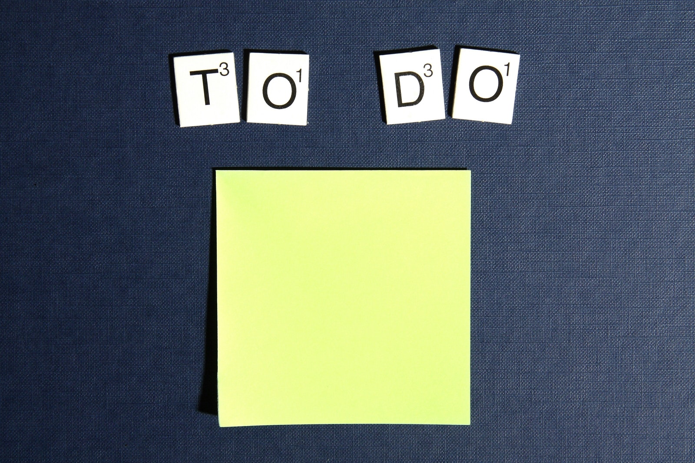

What comes to mind when you hear "retrospective"? For some, it might be memories of fun, relational team sessions where key problems were pointed out and addressed. For others, the word "retrospective" might conjure up images of meetings that are long, dull, and spent harping on the same points sprint after sprint. If you're a part of the second group, here are 12 ways you can make your retrospectives better right away!

### Create an upbeat environment
Nothing is worse than a dull or depressing retrospective. Ok, maybe there are some things that are worse - but that still doesn't mean your team should be dreading retrospectives. Just a few quick changes can make the retrospective something your whole team looks forward to. A few ways you can create an upbeat environment include:

#### 1. Give an opportunity for shout-outs
Make sure to keep the focus positive. Carve out time every week for shout outs - opportunities for team members to give each other credit for work done, initiative taken, and problems solved. Make sure to come ready with a few of your own to get things moving!

#### 2. Throw in fun, recurring elements
I've seen teams have little trophies or awards that are passed around every week. One of my personal favorites was a team that passed around a "salt award" (a big container of table salt with a bow on it) to team members who had a tough week. This came after a multi-sprint period where there was quite a bit of venting going on, and put a lighthearted spin on the process of airing out issues. **Find fun, unique elements that fit your team's personality and incorporate them into your retrospectives.**

#### 3. Have snacks
It might sound silly, but enjoying a cup of coffee and some snacks during a retrospective can instantly change the meeting from formal and dull to a more social, enjoyable atmosphere. I would encourage you to find budget room to splurge on some snacks for your team, or at the very least make the retrospective a brown bag lunch event.

### Keep the retrospective fresh
Another important part of holding regular retrospectives is making sure the process doesn't become too routine. When the same exact format is used every single week your team can become bored and disengaged; that's why you should change things up! Here are a few things you can do to "freshen up" your next retrospective:

#### 4. Take turns facilitating
This shouldn't be done in a brand new team, but once a team has gone through a few retrospectives together, have different team members take turns leading. This will serve a dual purpose - it will naturally change up your retrospectives as team members bring their own styles to the facilitator role, and it will make teammates more empathetic toward whoever is facilitating on a regular basis. It also helps a team rely less on the scrum master (assuming that is the person who regularly facilitates).

#### 5. Change what you’re doing 
While there are certain things that should be done at each retrospective (ie, the keep doing, start doing, and stop doing model), the way these questions are presented should be changed up regularly. There are quite a few resources available online that offer unique spins on the retrospective format... if you're drawing a blank, start by checking out the retrospective plans and activities [here](http://retrospectivewiki.org/index.php?title=Retrospective_Plans).

#### 6. Change your location
Sometimes all it takes to freshen things up is a change of scenery. Anything from a conference room on a different floor to a booth at a restaurant or an off-site facility will do; the important thing is that you put your team in different surroundings - you'd be surprised how much this can freshen up a retrospective. One great approach for smaller teams is the "walking retrospective" - do your retrospective while walking around a nearby park!

### Discover underlying issues
The real power of a retrospective happens when you dig down beyond surface-level reactions and discover the real causes behind the obstacles your team is facing. Here are a few ways to dig out underlying issues during your retrospectives:

#### 7. Focus on less problems
If your team is like most, there are a number of different problems that could come up during a retrospective. It's fine to let team members do some venting, but remember - the whole point of retrospectives is to find underlying issues and deal with them. Instead of having team members point out every single issue they can think of, **come to a consensus on one or two issues that are the most pressing**. Then take the time to really dig into those issues.

#### 8. Ask 5 Why's
The "5 Why's" technique is a quick, efficient way to get at the root of problems. It's not complicated - all it entails is asking "why" something happened, then using the response to shape another "why" question. Here's an example:

***

**Q: Why did the car stop?**

**A:** *The battery was dead*

**Q: Why was the battery dead?**

**A:** *The alternator wasn't working*

**Q: Why wasn't the alternator working?**

**A:** *The accessory belt was broken.*

**Q: Why was the belt broken?**

**A:** *It was worn out and old.*

**Q: Why was the belt worn out and old?**

**A:** *The routine maintenance schedule on the car hasn't been followed.*
***

And there it is - the true cause of a problem, buried under a few additional "why" questions. There's no magic to the "5 why's" - it's just a good way to get your team thinking about root causes.

#### 9. Root cause analysis (fishbone diagram)

A good visual approach to determining the source of issues is something called a "fishbone diagram". You can see a full explanation and example [here](http://asq.org/learn-about-quality/cause-analysis-tools/overview/fishbone.html). In a nutshell, a fishbone diagram is a graphical representation of a team brainstorming session on potential root causes of a problem. This is a great approach to dealing with problems that have could have multiple root causes.

### Deliver clear takeaways
The whole point of a retrospective is to find ways that a team can incrementally improve. Unfortunately, many teams can get stuck in a cycle of using the retrospective to vent about the same obstacles over and over instead of planning action steps to address their issues. If you want to use a retrospective to deliver clear takeaways, make sure to:

#### 10. Define and focus on actionable items
Every issue that will be addressed needs to have two things: clear, actionable steps to take and a person who is responsible for taking them. Even if the action step involves doing more research into a root cause over the next sprint, you still need to have a single, responsible party who will make sure this happens. Just like stories that go into your sprint, **action steps from a retrospective need to be clearly defined and independent chunks of work**.

#### 11. Make (and Revisit) an action item summary
Your action item summary can be as simple as a list of names with follow steps assigned to them, or something more complicated like a Jira board or other form of interactive task tracking. Either way, it is something that should be written down, sent out to the team, and revisited during the next retrospective to check up on progress. Make this a habit so that your team members will come into each retrospective ready to report on progress made toward their individual action steps from the last one.

#### 12. Create a poster / visual with takeaways
One very concrete activity you can try with your action steps is to make up some kind of poster or graphic reminder of your action items or takeaways from a retrospective. Then put this up in the center of your team space. One very easy way to get this started is to section off a piece of a whiteboard and jot down a few bullets. It's a simple but effective way of reminding the team about action steps that have been agreed on at the last retrospective.

***

### What's Your Next Step?
So what steps will you take to improve your team's next retrospective? Don't wait - all it takes is a few small tweaks to make retrospectives fun, engaging, and productive!

