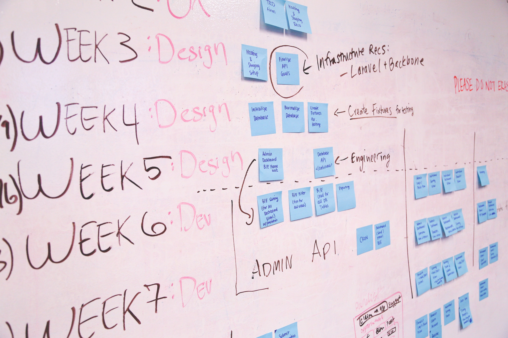

What do developers working as freelancers, in small startup teams, and in huge enterprise departments have in common?

 **We all have a hard time getting clear requirements!**
 
  Gathering requirements is a software development pain point in all kinds of contexts. Organizational communication issues are partially to blame, but the main difficulty in getting requirements is that it's simply hard work. **The nature of software makes it difficult to communicate requirements clearly and effectively.** 

Your customers often don't understand all the technical ins and outs of what they're asking for - and often you'll be working with customers who don't see the whole picture, or begin with an incomplete vision of what they want to achieve. Ideally development would be as simple as completing a series of clearly defined tasks - but often developers find themselves needing to help define the tasks before they can complete them!

***
## This difficulty highlights the importance of the product owner role in agile development.
***

A good product owner is responsible for providing an interface between developers and customers. He or she works with customers and developers to translate business requests into clear, bite-sized stories that follow [INVEST principles](https://www.agilealliance.org/glossary/invest/#q=~(filters~(postType~(~'page~'post~'aa_book~'aa_event_session~'aa_experience_report~'aa_glossary~'aa_research_paper~'aa_video)~tags~(~'invest))~searchTerm~'~sort~false~sortDirection~'asc~page~1)).

While the responsibility of gathering requirements should be in the hands of the product owner,members of the development team should understand some of the general do's and dont's for gathering requirements. Knowing how to gather good requirements can be helpful to developers when they find themselves without a product owner in place, but it can also help them work with and support their product owner. 

The following isn't an exhaustive list by any means- but it's a good starting place for getting clear technical requirements across industries and projects.

### 1. Talk to, and understand, customers

The goal of a software project isn't to use a specific technology, or even just to make excellent software. The goal is to meet a customer need. Good requirements start with defining clear customer needs. Doing this requires time spent with customers - understanding (and helping them understand) their needs for the project.
One excellent tool for connecting a business problem with a software solution is the [design sprint](http://www.gv.com/sprint/). If you haven't gone through a design sprint I would highly recommend it for your next big project!

### 2. Use supporting artifacts

There are a number of ways to document requirements, but I find that no matter what software approach you take to story tracking, supporting artifacts can be very helpful in communicating requirements. Get in the habit of including things like annotated screenshots - remember, a picture is worth a thousand words!

### 3. Provide "just enough" documentation

What is the ideal amount of documentation for requirements? Just enough to get the job done! Remember, your job is to build software, not to build software requirements. Take a lean approach to writing out requirements (keep a broad epic description to a single confluence page, for example). It will force you to focus in on the essentials and not spend too much time "in the weeds". 

### 4. Stick to the INVEST principles

This deserves an entire blog post of its own, but it's essential in an agile context to make sure that user stories follow these principles:
- **Independent:** shouldn't rely on outside factors in order to be completed
- **Negotiable:** should not be an explicit contract; should leave space for discussion
- **Valuable:** provides a clear user / business benefit upon completion
- **Estimable:** should be defined in a way that an effort estimate can be made
- **Small:** large tasks should be broken down into smaller chunks that can be accomplished in just a week or two.
- **Testable:** needs to contain enough information to make testing possible

### 4. Define what isn't required

Sometimes understanding what **isn't** required is as important as understanding what **is** required. Be clear and explicit about items like what browsers won't be supported in the current iteration, what features will not be included, and what functionality will not initially be present.

### 5. Keep open communication channels

Older waterfall methods of development assumed that a complete and comprehensive set of requirements would be put together and sent "downstream" to developers to implement. This methodology always hangs up when any changes need to be made, requiring huge additions of time and budget for any project. 

***
### Let's face it - in any software project, no matter how good the initial requirements are, they will never be good enough.
*** 

That's why it's so important that communication channels are kept open for the whole duration of a project. Conversations surrounding clarification, changes, and roadblocks need to be happening on a daily basis. This lets a team deal with issues as they come up rather than letting them sideline an entire effort.

